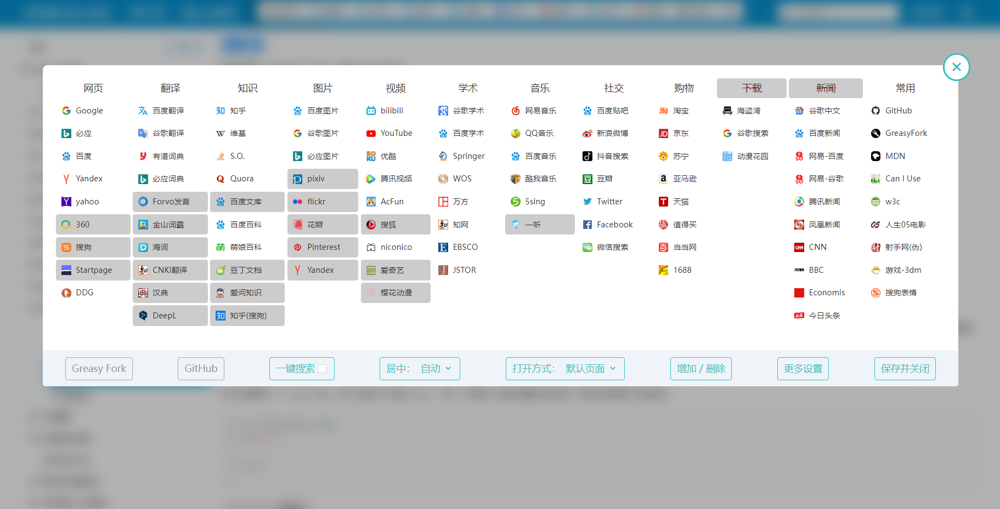

# SearchEngineJumpPlus 搜索引擎快捷跳转+

## 项目说明

本项目源自 [iqxin 维护的搜索引擎跳转脚本](https://github.com/qxinGitHub/searchEngineJump)，从 5.27.0 版本后 Fork 到本仓库独立开发。本来 Fork 过来是想给作者提 PR 的，然而作者不太常用 GitHub，之前一些人贡献的 PR 也没合并到主分支，加上 2022-12-03 后进行了大规模的重构导致没办法直接同步原仓库的更改，于是暂时 Detach Fork 了，以后会在这个仓库继续更新，并不定时推送到 GreasyFork 和 OpenUserJS。

## 使用说明

### 搜索页跳转

在脚本管理器中启用脚本后，当访问支持的搜索页时，页面中会显示脚本的跳转小横条，你可以点击其中的按钮跳转到相应的搜索引擎，并自动按照当前搜索框中的内容进行快捷的一键搜索。

### 划词搜索

访问不支持搜索框的其它页面时，脚本默认开启划词搜索功能，在页面中使用鼠标划动取词，页面上方会弹出跳转小横条，此时可以点击其中的按钮跳转到相应的搜索引擎，并自动按照当前划词内容进行快捷的一键搜索。

### 深色模式

脚本支持深色模式，但不同的页面对深色模式的适配不同，导致部分不支持深色模式的网站与操作系统或浏览器的默认设置冲突，因此建议与 [Dark Reader 拓展](https://darkreader.org/) 共同使用，自动根据操作系统设置渲染深色页面。

### 设置菜单

跳转小横条的最后有设置按钮，点击后进入设置菜单，或者从脚本管理器的选项中也可以进入设置菜单。在设置菜单中可以对脚本的搜索引擎进行配置，例如拖拽调整位置、点击切换启用状态、添加或删除搜索引擎等。

## 更新历史

- version 5.31.9 2023-01-12

  - 调整：百度宽屏适配

- version 5.31.8 2023-01-11

  - 调整：同步原脚本对 Baidu 的修改
  - 调整：更新 bing 链接
  - 修复：某些页面的 CSS 冲突问题

- version 5.31.7 2023-01-11

  - 修复：设置面板红色删除线消失问题

- version 5.31.6 2023-01-10

  - 调整：优化深色模式体验

- version 5.31.5 2023-01-09

  - 添加：文档使用说明和图片
  - 调整：百度样式
  - 修复：某些网页按钮样式被覆盖的问题
  - 修复：position 的 sticky 样式导致的某些网站顶部固定失效的问题
  - 修复：维基百科页面下样式错乱的问题

- version 5.31.4 2023-01-06

  - 修复：下拉菜单按钮禁止选择
  - 修复：GitHub 搜索改版导致的插入失败

- version 5.31.3 2022-12-23

  - 调整：优化深色模式逻辑，适配 Firefox

- version 5.31.2 2022-12-19

  - 调整：划词搜索顶部 Wrapper
  - 调整：划词搜索显示层级

- version 5.31.1 2022-12-18

  - 调整：边缘样式向 Fluent UI 靠拢
  - 调整：适配 Quora
  - 调整：优化顶部吸附体验
  - 修复：贴吧全屏样式、雅虎样式、有道词典样式
  - 修复：某些页面跳转 target 问题

- version 5.31.0 2022-12-11

  - 调整：代码的大部分框架已经重构完成，细节有待继续优化
  - 调整：动画样式
  - 调整：设置页弹出通知优化
  - 调整：设置按钮样式
  - 调整：下拉样式
  - 修复：错误的更新逻辑
  - 修复：设置面板 label 颜色问题

- version 5.30.4 2022-12-10

  - 调整：代码重构
  - 调整：StartPage 跳转链接
  - 调整：更新逻辑
  - 修复：更新版本号浅拷贝问题
  - 修复：单页应用路由变化问题
  - 修复：路由变化导致的设置列表加载失败问题
  - 修复：路由变化导致的多次加载问题
  - 修复：Post 请求跳转与标签默认行为冲突问题

- version 5.30.3 2022-12-10

  - 调整：优化划词体验

- version 5.30.2 2022-12-05

  - 添加：百度文库、百度贴吧全吧搜索重新适配
  - 调整：重构大部分代码，减少冗余，提高可读性
  - 调整：微博跳转引擎问题
  - 调整：console info 样式
  - 调整：去除自定义 rules 支持
  - 调整：阴影样式
  - 调整：百度贴吧、有道翻译、萌娘百科、谷歌图片、必应图片、百度图片、Bilibili、网易云音乐、谷歌学术样式
  - 调整：顶部吸附逻辑
  - 调整：删除乐视视频

- version 5.30.1 2022-12-05

  - 调整：重构部分代码，逻辑拆分，减少冗余代码，提高可读性
  - 修复：某些网站设置提示的样式错误问题
  - 修复：添加网站时不指定协议时无法正确添加的问题

- version 5.30.0 2022-12-04

  - 调整：CSS 文件拆分，精简代码

- version 5.29.10 2022-12-04

  - 修复：某些网站图标位置错乱问题
  - 调整：显示字体
  - 调整：分类名称

- version 5.29.9 2022-12-04

  - 添加：版本号支持
  - 调整：设置菜单按钮样式

- version 5.29.8 2022-12-04

  - 调整：夜间模式设置按钮样式

- version 5.29.7 2022-12-04

  - 调整：设置页样式

- version 5.29.6 2022-12-03

  - 同步更新源仓库代码 5.26.1-5.26.3 的代码
  - 调整：支持所有站点的划词搜索，有时候可能与某些网站不兼容需要手动关闭
  - 调整：Bilibili 样式及多个搜索子页面
  - 修复：排除与划词搜索不兼容的 cubic-bezier.com

- version 5.29.5 2022-11-25

  - 调整：深色模式按钮和阴影样式

- version 5.29.4 2022-11-10

  - 修复：强制居中失效问题

- version 5.29.3 2022-11-09

  - 增加：萌娘百科、StackOverflow 适配
  - 调整：知网、百度百科样式

- version 5.29.2 2022-11-09

  - 调整：YouTube 样式
  - 调整：滑词模式样式、普通搜索居中样式
  - 调整：全面 https 化
  - 修复：Edge 上百度贴吧遮挡有用信息的问题
  - 修复：海词、必应图片、pixiv、花瓣、Pinterest、Yandex 图片、QQ 音乐跳转问题
  - 修复：跳转到一听音乐跳转栏消失问题
  - 修复：豆瓣跳转栏换行问题
  - 修复：什么值得买、1688 样式错乱问题
  - 修复：必应图片下拉遮挡跳转栏问题

- version 5.29.1 2022-11-05

  - 调整：滑词模式样式

- version 5.29.0 2022-11-05

  - 增加：百度学术、谷歌学术、知网、万方、百度贴吧、淘宝、微博、豆瓣、QQ 音乐、一听、腾讯视频重新适配

- version 5.28.1 2022-11-05

  - 调整：GitHub 适配

- version 5.28.0 2022-11-05

  - 调整：使用 Flexbox 重写样式
  - 调整：调整部分网站适配
  - 修复：解决鼠标悬停在按钮上时候的 1 像素白色缝隙问题
  - 修复：删除和修改部分不需要跳转的网站

- version 5.27.0 2022-11-04

  - Forked by MUTED
  - 调整：更改跳转横条的样式为圆角，修复一些边距和网页嵌入问题，并在部分网站上使用 sticky 优化顶部固定体验

- version 5.26.0 2022-11-03

  - 增加: 划词搜索功能, 可以在设置菜单中关闭
  - 调整: 样式进行更改, 去除三角箭头, 下拉搜索菜单改为居中显示

- version 5.25.1 2022-10-27

  - 修复: 抖音搜索界面颜色问题

- version 5.25.0 2022-10-27

  - 增加: 支持谷歌的夜间模式
  - 调整: 更新了部分图标, 但是需要用户自己重置设置才能使用新图标

- version 5.24.19 2022-09-28

  - 增加: 支持慢慢买网站

- version 5.24.18 2022-09-11

  - 修复: 上个版本会导致关闭“隐藏同站链接”后, 如果搜索链接是某一具体网站, 搜索词出现很多 site 的问题

- version 5.24.17 2022-09-10

  - 修复: 京东搜索页面, 搜索栏过长会导致京东页面错位的问题。[感谢 abossk 反馈](https://greasyfork.org/zh-CN/scripts/27752-searchenginejump/discussions/147572)
  - 更改: 如果搜索内容中有 site: , 跳转将不再删除 site 及其后面的内容。

- version 5.24.16 2022-09-04

  - 修复: 谷歌搜索,菜单两行时遮挡工具栏的问题

- version 5.24.15 2022-08-24

  - 修复: YouTube 网站无工具栏的问题
  - 记录: 去掉了 hashList, 完全用标题监视器替代, 只要百度页面没问题就问题不大。

- version 5.24.14 2022-08-24

  - 增加: 可以隐藏文字只保留图标。 设置-更多设置-配置文件 "icon" 的值改为 0, 1 是默认图标, 2 是抽象图标。
  - 修复: 多个网站的样式调整
  - 修复: "隐藏同站链接" 现已经可以正常工作

- version 5.24.13 2022-08-23

  - 增加: 添加设置 “隐藏同站链接”。 设置 - 更多设置 - 隐藏同站链接: 默认开启,百度页面会隐藏百度搜索。如果想在同一个搜索网站,但是想通过不同语言来搜索, 可以选择 false 来实现。 目前有问题 2022-08-23 todo: 隐藏同站链接会间歇性失效。
  - 增加: 支持网站 brave.com, neeva.com(延迟加载)
  - 记录: 谷歌去掉了 magin, 添加了 class: "s6JM6d",用来对齐。 此版本可以给 #sej-container 添加额外的 class
  - 登上 github 发现好多问题反馈。。。

- version 5.24.12 2022-08-06

  - 修复: ecosia.org 搜索网址的变动
  - 修复: 知乎页面出现两个搜索栏的问题

- version 5.24.11 2022-07-31

  - 修复: 百度页面更换搜索词或者点击下一页导致 样式丢失的问题。大概率是本月初 v5.24.6 更新导致的问题,当时为了兼容“ac 百度”删除了关于百度搜索的部分代码。目前不确定是否解决, 具体有问题在反馈
  - 修复: f 搜网址的变更 [感谢 ZZH-qwq 反馈](https://greasyfork.org/zh-CN/scripts/27752-searchenginejump-%E6%90%9C%E7%B4%A2%E5%BC%95%E6%93%8E%E5%BF%AB%E6%8D%B7%E8%B7%B3%E8%BD%AC/discussions/119203)
  - 增加: 支持谷歌镜像网站的跳转,谷歌.ml xn--flw351e.ml [感谢 nvfddbgfh 意见](https://greasyfork.org/zh-CN/scripts/27752-searchenginejump-%E6%90%9C%E7%B4%A2%E5%BC%95%E6%93%8E%E5%BF%AB%E6%8D%B7%E8%B7%B3%E8%BD%AC/discussions/64397#comment-310585)

- version 5.24.10 2022-07-25

  - 修复: 一键搜索无法打开包含 site 搜索的问题 [[感谢 HelloWeirdTourist 反馈](https://greasyfork.org/zh-CN/scripts/27752-searchenginejump/discussions/142314)

- version 5.24.9 2022-07-23

  - 修复: 列表超过 10 个无法添加的问题。[感谢 HelloWeirdTourist 反馈](https://greasyfork.org/zh-CN/scripts/27752-searchenginejump/discussions/142261)
  - 修复: 调整知网搜索网址。[感谢 Holiday2019 的帮助](https://greasyfork.org/zh-CN/scripts/27752-searchenginejump/discussions/116013)
  - 修复: 淘宝页面样式的问题

- version 5.24.8 2022-07-04

  - 修复: 开启"AC-baidu-重定向优化百度搜狗谷歌必应搜索*favicon*双列"脚本的百度 lite 后,遮挡的问题

- version 5.24.7 2022-07-03

  - 修复: 开启"AC-baidu-重定向优化百度搜狗谷歌必应搜索*favicon*双列"脚本后,下拉菜单会被页面其他内容遮挡的问题。
  - 已知问题: 两个脚本共存时, 百度下拉页面无法固定搜索栏, 后续会修复。

- version 5.24.6 2022-07-03

  - 修复: 开启"AC-baidu-重定向优化百度搜狗谷歌必应搜索*favicon*双列"脚本后, 百度页面下拉菜单偏移的问题, 但是需要手动开启, 开启方法: 菜单 - 居中 - 强制 。由于该脚本会延迟加载, 导致以前用的自动获取失效, 如果两个脚本同时启用, 务必在“菜单”中将“居中”改为“强制”。
  - 感谢评论区里各位, 在我消失不见的这段时间里依旧不断反馈该问题。

- version 5.24.5 2022-03-19

  - 修复: 在 5.24.3 版本 错误删除 duckduckgo.com 网站, 恢复一听音乐www.1ting.com [感谢 JY3 提醒](https://greasyfork.org/zh-CN/scripts/27752-searchenginejump/discussions/123460#comment-279499)

- version 5.24.4 2022-03-18

  - 修复: 兼容 bilibili 搜索界面的新旧两种版面。带来的问题就是在 b 站固定到顶端几乎没法使用,属于两害相较取其轻了。[感谢 iamking22 反馈](https://greasyfork.org/zh-CN/scripts/27752-searchenginejump/discussions/123330)

- version 5.24.3 2022-03-15

  - 尚未解决的问题: 头条搜索无法跳转到淘宝;
  - 下面增加新的搜索, 还有搜索网站顺序的调整不影响老用户
  - 增加: 增加 f 搜的支持。感谢[ZZH-qwq](https://greasyfork.org/zh-CN/scripts/27752-searchenginejump/discussions/119203)的代码提供, 由于处于该搜索处于内测阶段,未验证代码的准确性。
  - 增加: 对今日头条搜索的支持,修复今日头条搜索链接错误的问题
  - 增加: 抖音搜索, 在社交列表; 对抖音搜索的支持(颜色显示有问题)
  - 修复: 雅虎日本搜索失效的问题
  - 修复: 哔哩哔哩搜索改版导致失效的问题,[看不见我看不见我 反馈](https://greasyfork.org/zh-CN/scripts/27752-searchenginejump/discussions/123251)
  - 界面: 删除一听音乐www.1ting.com、音悦台yinyuetai.com、图片easyicon.net、人人影视zimuzu.tv、果壳guokr.com、秘迹搜索mijisou.com、DOG duckduckgo.com 等网站

- version 5.24.2 2021-06-30

  - 修复: 在有道搜索页面再次搜索时缺失的问题。感谢[spn](https://greasyfork.org/zh-CN/scripts/27752/discussions/90926)
  - 增加: 金山词霸的支持. 感谢[spn](https://greasyfork.org/zh-CN/scripts/27752/discussions/91053)的代码提供
  - 修复: 部分网站,例如金山词霸网站中, 设置界面图标不正常的问题。

- version 5.24.1 2021-06-23

  - 修复: 企查查的搜索链接不准确的问题。感谢[kidzgy](https://greasyfork.org/zh-CN/scripts/27752/discussions/90497)
  - 增加: 1688 网站添加搜索栏

- version 5.24.0 2021-06-21

  - 增加: 设置中增加关闭动画效果的选项
  - 增加: 天眼查,企查查 感谢[kidzgy](https://greasyfork.org/zh-CN/scripts/27752/discussions/90497)的代码提供

- version 5.23.10 2021-06-14

  - 增加: 对www.ecosia.org网站的支持 [感谢 lisariel](https://greasyfork.org/zh-CN/scripts/27752-searchenginejump/discussions/90001)

- version 5.23.9 2021-05-22

  - 修复: 谷歌搜索页面与自带的工具重叠的问题
  - 优化: 在设置界面,搜索列表过多时,增加了与边缘的空隙

- version 5.23.8 2021-05-22

  - 修复: 5.23.7 版本导致部分用户无法使用的情况(原因是调用了已经被用户删除的列表,导致错误)
  - 修复: 百度页面搜索翻译内容,底色缺失的问题,调整了父元素的 index 至 101

- version 5.23.7 2021-03-19

  - 修复: 鼠标从分类列表移到到菜单上,会导致列表不断下移的情况 [感谢 kidzgy](https://greasyfork.org/zh-CN/scripts/27752-searchenginejump/discussions/79010)
  - 界面: b 站图标 [感谢 kidzgy](https://greasyfork.org/zh-CN/scripts/27752-searchenginejump/discussions/79010)

- version 5.23.6 2021-03-16

  - 修复: 什么值得买 层级过高
  - 修复: 列表退出动画缺失
  - 修复: 百度界面子列表偏移
  - 修复: 谷歌图片下拉不显示
  - 优化: 域名匹配规则 `// @include *://*.yahoo.tld/*` [感谢 dnknn](https://greasyfork.org/zh-CN/users/35765-dnknn)
  - 界面: 增加部分毛玻璃效果, 部分进入退出动画修改

- version 5.23.5 2021-03-07

  - 修复: AcFun 网站
  - 优化: duckduckgo Yandex
  - 删除: 虾米音乐 一号店 闲鱼

- version 5.23.4 2020-12-27

  - 优化:删掉部分不需要匹配的网站

- version 5.23.3 2020-12-26

  - 优化:删掉部分不需要匹配的网站

- version 5.23.2 2020-12-23

  - 修复: 必应页面搜索栏未对齐的问题 [感谢 小时候骑上竹马咱就是将军](https://greasyfork.org/zh-CN/scripts/27752-searchenginejump-%E6%90%9C%E7%B4%A2%E5%BC%95%E6%93%8E%E5%BF%AB%E6%8D%B7%E8%B7%B3%E8%BD%AC/discussions/71057)

- version 5.23.1 2020-12-22

  - 修复: 匹配所有谷歌网址(之前只会匹配主站 com) [感谢 zy G](https://greasyfork.org/zh-CN/scripts/27752-searchenginejump-%E6%90%9C%E7%B4%A2%E5%BC%95%E6%93%8E%E5%BF%AB%E6%8D%B7%E8%B7%B3%E8%BD%AC/discussions/71035)

- version 5.23.0 2020-12-19

  - 修复: 一个严重影响脚本运行的问题, 重新导入配置后,脚本很大几率加载错误的问题
  - 修复: 百度文库
  - 增加: 购物网站亚马逊
  - 优化: 有道搜索 startpage
  - 优化: 不再匹配所有网站,只匹配相关网站
  - 界面: 百度图标, B 站图标

- version 5.22.5 2020-10-15

  - 删除腾讯微博,google+ [感谢 wsxy162](https://greasyfork.org/zh-CN/scripts/27752-searchenginejump/discussions/64302)
  - 网站 dogedoge 兼容“ac 百度” [感谢 benzBrake](https://greasyfork.org/zh-CN/scripts/27752-searchenginejump/discussions/64242)
  - 视频增加樱花动漫 特别感谢[storyInAugest](https://greasyfork.org/zh-CN/scripts/27752-searchenginejump/discussions/30535)的贡献
  - 增加 “启用”、“禁用” 的提示

- version 5.22.4 2020-09-05

  - 百度百科 层级过高的问题
  - startpage.com 网站修复
  - github.com 网站修复

- version 5.22.3 2020-08-02

  - dogedoge 堆叠顺序过高的问题
  - 翻译列表增加 DeepL
  - 与脚本“AC-baidu”的兼容问题
  - （上一个版本错误 少了 v_5.22.1）

- version 5.22.2 2020-08-02

  - 图标微调
  - 增加"雅虎日本搜索"支持

- version 5.22.0 2020-08-01

  - 1688 出现乱码的问题
  - 百度出现遮挡的问题

- version 5.21.2 2020-05-04

  - 修复谷歌图片
  - 修复 A 站链接
  - 兼容脚本“知乎排版优化”

- version 5.21.1 2020-02-20

  - 样式微调

- version 5.21.0 2020-02-04

  - 兼容脚本 [AC-baidu:重定向优化百度搜狗谷歌搜索*去广告\_favicon*双列](https://greasyfork.org/zh-CN/scripts/14178), 在设置菜单中添加相关选项

- version 5.20.0 2020-01-27

  - 增加一键搜索。点击该搜索分类的图标后，会在后台打开该分类所有的搜索网站进行搜索
  - 设置页面微改

- version 5.19.0 2020-01-26

  - 编码问题，默认所有搜索进行转码(可以搜索 c#而不会变成 c 了)。其中 1688 采用 gbk 编码，规则中添加 gbk 选项
  - 添加网站样式 google.infinitynewtab.com | www.dogedoge.com
  - 增加搜索引擎 Yandex
  - 修复知乎网站 网易云(依旧有问题:无法固定到顶端)
  - 时光不弃 岁月静好 新年平安

- version 5.18.2 2019-04-19

  - 添加秘迹搜索，[感谢 swearwr 的帮助和 lukemin 的建议](https://greasyfork.org/zh-CN/forum/discussion/55490/x)
  - YouTube 通过搜索播放视频时，会在视频上方出现搜索栏，可以刷新一遍网页暂时去除，等待后续更好的处理办法

- version 5.18.1 2019-02-28

  - 添加 startpage 网页搜索
  - 添加 当当网 购物搜索
  - 添加 酷我音乐 5sing 歌曲搜索

- version 5.18.0 2019-02-28

  - 当固定到顶端后，增加只有上拉才出现的选项： 设置-更多设置-配置文件 fixedTopUpward 将 false 改为 true [感谢 黄志东 建议](https://greasyfork.org/zh-CN/forum/discussion/50315/x)

- version 5.17.3 2019-02-21

  - 搜狗搜索页面改版 [感谢 Fordo 反馈](https://greasyfork.org/zh-CN/forum/discussion/51921/x)
  - 自用里面添加搜狗表情搜索
  - 好久不见，愿每个人都会被温柔的对待

- version 5.17.2 2018-12-21

  - 添加搜索 购物 - 什么值得买 [感谢 iqeq 建议](https://greasyfork.org/zh-CN/forum/discussion/48023/x)

- version 5.17.1 2018-12-09

  - "固定到顶端" 开启后，谷歌搜索中，搜索栏被遮挡的问题(有瑕疵)
  - 将 YouTube 搜索栏置中，已知问题：无法固定到顶端
  - www.startpage.com 网站添加搜索栏
  - 个别名称更改

- version 5.17.0 2018-08-03

  - 增加图标选项，当用户添加自定义搜索时，可以选择使用 google 获取图标，或者域名获取，或者 dnspot 获取。 设置 - 更多设置 - 配置菜单 - getIcon 。具体可查看当中的 message 进行相关设置
  - 导入中增加网盘搜索 由[奔跑中的奶酪](https://www.runningcheese.com/resources)整理。

- version 5.16.2 2018-07-02

  - 移除广告

- version 5.16.1 2018-06-30

  - 添加新的搜索分类 电子书，从导入中添加 。 设置 - 更多设置 - 导入 ； 由[奔跑中的奶酪](https://www.runningcheese.com/search-engines)整理。

- version 5.16.0 2018-06-29

  - 增加导入功能，目前只能导入我设置好的， 设置 - 更多设置 - 导入 ； 只添加了 一个搜索类别， 后续会逐渐补充。 先补充由奔跑中的奶酪整理的[精选搜索引擎大全](https://www.runningcheese.com/search-engines)
  - 删掉成人网站的搜索链接

- version 5.15.15 2018-06-29

  - 更新了广告

- version 5.15.14 2018-06-25

  - 添加新的搜索分类 - 新闻搜索 [感谢 Github 评论区 Hipd 建议](https://github.com/qxinGitHub/searchEngineJump/issues/9) , 以及 chinchihyu 提供的网址，由[奔跑的奶酪整理的搜索引擎](https://www.runningcheese.com/search-engines)
  - 知识搜索列表中添加 quora , stackoverflow

- version 5.15.13 2018-06-25

  - 添加了广告

- version 5.15.12 2018-06-17

  - 添加 yandex 搜索页面的搜索样式。 有瑕疵，会遮盖源网页的内容

- version 5.15.11 2018-06-11

  - 知乎网页调整

- version 5.15.10 2018-05-10

  - dge 浏览器中分类背景是透明的 [感谢 Github 评论区 WLYYL 反馈](https://github.com/qxinGitHub/searchEngineJump/issues/6)

- version 5.15.9 2018-04-08

  - 若对百度页面使用了 style 调整样式，可以修改配置文件中的 baiduOffset 修复二级菜单的偏移

- version 5.15.8 2018-04-04

  - b 站搜索栏丢失的问题
  - 设置中，正在编辑标题不点确认的情况下，点击另一个标题编辑会使标题名称出错的问题

- version 5.15.7 2018-03-25

  - 必应图片搜索错位

- version 5.15.6 2018-03-08

  - 修复谷歌图书会被错误隐藏的问题[感谢评论区 tensun tsai 反馈](https://greasyfork.org/zh-CN/forum/discussion/comment/48233#Comment_48233)
  - 百度学术界面无搜索框
  - 此版本开始默认折叠当前搜索分类

- version 5.15.5 2018-03-05

  - 修改 a 站搜索连接，修复 a 站样式

- version 5.15.4 2018-02-15

  - 添加搜狗搜索

- version 5.15.3 2018-01-19

  - 谷歌搜索界面，，错误地隐藏了下载分类下的谷歌搜索 [感谢评论区 wsxy162 反馈](https://greasyfork.org/zh-CN/forum/discussion/comment/46012#Comment_46012)

- version 5.15.2 2018-01-07

  - “打开方式”总会自动跳回“默认页面”而不是“新标签打开” [感谢评论区 cll12 反馈](https://greasyfork.org/zh-CN/forum/discussion/comment/45425#Comment_45425)

- version 5.15.1 2017-12-15

  - 修复百度百科, 搜狗搜索, 360 好搜, facebook 的问题，[感谢评论区 Ring 反馈](https://greasyfork.org/zh-TW/forum/discussion/comment/44291#Comment_44291)

- version 5.15.0 2017-12-13

  - 设置界面可以拖动

- version 5.14.0 2017-12-12

  - 可以隐藏设置界面右上角的关闭按钮 配置文件 closeBtn
  - 隐藏设置按钮后需要刷新页面才能再次打开的问题
  - 其他小细节的统一

- version 5.13.1 2017-12-11

  - 优酷搜索连接变动[感谢反馈](https://greasyfork.org/zh-CN/forum/discussion/31999/x)

- version 5.13.0 2017-12-11

  - 更改拖拽排序的实现方法，使其更直观易用

- version 5.12.12 2017-12-10

  - 知乎界面改动
  - 搜索列表变动：html 搜索列表合并至 mine 中

- version 5.12.11 2017-11-27

  - 翻译列表增加海词搜索[感谢建议](https://greasyfork.org/zh-CN/forum/discussion/31670/x)，老用户默认禁用
  - 淘宝页面鼠标划过商品后，会遮挡工具栏的问题

- version 5.12.10 2017-11-19

  - 增加了下载搜索列表, 默认隐藏 [感谢建议](https://greasyfork.org/zh-CN/forum/discussion/31317/x)
  - 增加了几个或许将来要用到的设置选项

- version 5.12.9 2017-11-04

  - 天猫超市导致源网页侧边栏错位的问题 [感谢反馈](https://greasyfork.org/zh-CN/forum/discussion/30899/)
  - 修复上个版本导致知乎固定到顶栏错位的问题

- version 5.12.8 2017-10-27

  - 淘宝等网站固定到顶栏，会出现错位的问题，依旧有瑕疵。
  - 此版本开始火狐用户无法从菜单中直接点击禁用菜单按钮
  - 百度页面向上滚动时，隐藏搜索框下面的联想提示

- version 5.12.7 2017-10-18

  - 修复"固定到顶端"修改后保存，无法及时生效的问题
  - 消息提示框位置错误的问题
  - 按钮配色，动画微小调整

- version 5.12.6 2017-10-10

  - 修复图标偏移

- version 5.12.5 2017-10-04

  - 更改设置后无需重新加载页面
  - 设置界面调整： 配色 位置 字体

- version 5.12.4 2017-09-23

  - 移除 “更多设置-列表排序” 功能，现在可以拖动列表标题排序
  - 增加搜索： 购物-闲鱼，mine-GreasyFork
  - 设置界面 图标与名称未对齐的问题

- version 5.12.3 2017-09-10

  - 设置菜单集成到 Tampermonkey 菜单中
  - 点击"设置按钮透明度"后的数字可隐藏设置菜单，重新打开需从 Tampermonkey 菜单中打开，火狐用户请无视此项更新
  - 林花谢了春红，太匆匆 --李煜 相见欢

- version 5.12.2 2017-09-01

  - 设置菜单中，被禁用的搜索缺失删除线的问题
  - youtube 改版
  - 从百度文库跳转时乱码的问题[感谢反馈](https://greasyfork.org/zh-CN/forum/discussion/28783)
  - 调整了最低宽度，在一般屏上有更好的表现 [感谢反馈](https://greasyfork.org/zh-CN/forum/discussion/28783)

- version 5.12.1 2017-08-27

  - 固定搜索栏的情况下，在百度页面二级搜索菜单错位的问题
  - 谷歌页面样式微调

- version 5.12.0 2017-08-21

  - 增加 post 提交方方式 搜索连接后跟‘$post$xx’ 其中的 xx 是指 post 提交的名称 [相关反馈](https://greasyfork.org/zh-CN/forum/discussion/28440/x)
  - 修复“搜索项目”可以与“分类名称”拖拽的问题 [感谢反馈](https://greasyfork.org/zh-CN/forum/discussion/27907/x)
  - 在 searx、搜狗 页面添加样式

- version 5.11.2 2017-08-20

  - 设置菜单可视区域过低时，设置按钮 无法自动置底的问题 [感谢反馈](https://greasyfork.org/zh-CN/forum/discussion/27907/x)
  - 添加雅虎搜索

- version 5.11.1 2017-08-19

  - 谷歌搜索页面下，“列表排序”间隙过大的问题
  - 打磨动画 😂

- version 5.11.0 2017-08-18

  - 增加列表排序的功能：设置-更多设置-列表排序
  - ~~修复在 奔跑的奶酪定制版火狐 v8 设置菜单错位的问题~~
  - 默认隐藏 html 搜索列表; javlibrary 搜索连接修复; 删除百度知道; 增加萌娘百科
  - 设置界面样式微调

- version 5.10.3 2017-08-10

  - 输入框改为获取焦点后自动选中文本，之前是鼠标点击输入框自动选中文本
  - 火狐浏览器设置界面全选的问题
  - 必应搜索，“更多设置”菜单错位的问题

- version 5.10.2 2017-08-09

  - 设置界面样式调整，增加多个设置按钮。更改设置界面的打开关闭动画

- version 5.10.1 2017-08-09

  - 去除关闭按钮的旋转动画
  - 去除莫名多的 margin 属性

- version 5.10.0 2017-08-08

  - 增加固定到顶端选项,页面向下滚动后工具条能保持在页面顶部。“设置 - 高级 - fixedTop” 改为 true, 某些页面兼容的并不是很好 [感谢建议](https://greasyfork.org/zh-CN/forum/discussion/27478/x)

- version 5.9.2 2017-08-07

  - 设置菜单可视区域过低时，无法滚动到顶部的问题

- version 5.9.1 2017-08-06

  - 设置菜单可视区域过低时，无滚动条的问题[感谢反馈](https://greasyfork.org/zh-CN/forum/discussion/27907/x)

- version 5.9.0 2017-08-05

  - 添加增删搜索列表的功能
  - 增加 debug 设置-高级-debug (从同类脚本上扒过来的)
  - 众多细节调整

- version 5.8.1 2017-07-29

  - 依旧无法排除针对某一网站搜索的情况[感谢反馈](https://greasyfork.org/zh-CN/forum/discussion/27527/x)

- version 5.8.0 2017-07-28

  - 增加配置文件中 rules 信息，功能同脚本中的 rules 一样，但优先级更高,配置文件更新至 1.6
  - 之前会去掉跳转到当前搜索的搜索，现在会排除搜索引擎针对某一网站搜索的情况 site:xxx.xx [如反馈中的这种情况](https://greasyfork.org/zh-CN/forum/discussion/27527/x)
  - 修改本地配置文件后，某些情况下部分信息会被默认配置覆盖的问题

- version 5.7.0 2017-07-26

  - 增加修改设置按钮透明度的功能，设置-高级-setBtnOpacity 后面的数字为透明度取值 0-1，-1 为关闭设置按钮。配置文件更新至 1.5
  - 删掉配置文件中的 details 信息，整合到 engineDetails 中
  - 个别网站样式调整

- version 5.6.3 2017-07-24

  - 修复打开方式无法设置为新标签页打开 [感谢反馈](https://greasyfork.org/zh-CN/forum/discussion/27413)
  - 个别网站样式调整

- version 5.6.2 2017-07-23

  - 剔除配置文件中无用的信息
  - 修复在百度页面打开设置存在的样式问题
  - 完善腾讯视频搜索样式

- version 5.6.1 2017-07-20

  - 默认添加 360 搜索,爱奇艺视频及网页顶部搜索栏 [感谢反馈](https://greasyfork.org/zh-CN/forum/discussion/27278/x)
  - 视频分类默认添加腾讯视频搜索，未能实现顶部搜索栏，原因查找中
  - 修复网易云音乐跳转默认添加"&type=1" 的问题 [感谢反馈](https://greasyfork.org/zh-CN/forum/discussion/27196/x)

- version 5.6.0 2017-07-16

  - 增加折叠当前搜索分类选项
  - 增加配置文件直接修改代码的选项
  - 设置界面按钮调整
  - 默认隐藏学术搜索列表

- version 5.5.1 2017-06-07

  - 添加新的搜索时，图标会优先从 google 的 API 获取，网络不通的情况下使用域名加 favicon.ico 的方式获取 [感谢建议](https://greasyfork.org/zh-CN/forum/discussion/24961/x)
  - 细节优化，重置设置时增加询问窗口

- version 5.5.0 2017-06-04

  - 增加搜索分类的名称更改的功能
  - 设置细节优化

- version 5.4.0 2017-06-01

  - 增加对已有搜索列表更改的选项
  - 细节优化: 修改设置界面的部分图标和增加部分动画

- version 5.3.0 2017-05-29

  - 增加全局 “新标签页打开” 选项, 配置文件版本改为 1.2

- version 5.2.2 2017-05-28

  - 分类中的 mine 分类(或多个)无法显示的问题

- version 5.2.1 2017-05-27

  - 最多只能添加 9 个搜索，继续增加无法显示的问题 [感谢反馈](https://greasyfork.org/zh-CN/forum/discussion/24342/x)
  - 更改用户体验：文字不能被选中

- version 5.2.0 2017-05-20

  - 增加添加删除搜索的功能：无容错能力，不会判断你的输入是否正确，搜索连接中的搜索网址需用 %s 替代,添加完后，如需移动，禁用，删除的需要“保存并关闭”然后在设置。

- version 5.1.5 2017-05-14

  - 必應錯位 [感謝反饋](https://greasyfork.org/zh-CN/forum/discussion/23528/x)

- version 5.1.4 2017-05-12

  - qq 音樂網址變更 [感謝反饋](https://greasyfork.org/zh-CN/forum/discussion/23366/x)

- version 5.1.3 2017-05-11

  - 上一个版本忘改版本号就发布出去(改版本後，greasyfork 無視僅有版本號的更新)
  - 翻譯(百度，谷歌，必應，有道都有所調整)小調樣式 [感谢反馈](https://greasyfork.org/zh-CN/forum/discussion/23297/x)

- version 5.1.2 2017-05-11

  - 由于上个版本的修改导致，从百度主页搜索无跳转栏的问题

- version 5.1.2 2017-05-11

  - 从谷歌主页搜索后刷新页面，跳转栏丢失的问题 [感谢反馈](https://greasyfork.org/zh-CN/forum/discussion/23230/x)
  - 网速不好的情况下，从谷歌主页搜索无样式的问题

- version 5.1.1 2017-05-10

  - 添加动画效果
  - 将设置改为弹性布局(测试)

- version 5.1.0 2017-05-10

  - 增加修改源网页的能力，用以兼容脚本
  - 与 Google Variety 样式不兼容的问题
  - google 搜索页面中样式微调
  - 配置文件的版本无法自动更新问题

- version 5.0.5 2017-05-10

  - 添加搜狗知乎搜索 [感谢建议](https://greasyfork.org/zh-CN/forum/discussion/23140/x)
  - 添加搜狗微信搜索 (在分类 mine 中)
  - 本地数据存储版本升级为 1.1

- version 5.0.4 2017-05-9

  - 5.0.0.2 中与样式“Google Variety”不兼容问题修改后弊大于利，暂时改回去

- version 5.0.3 2017-05-09

  - 设置中无法保存新标签页打开的问题
  - 修复因为 5.0.0 版本导致谷歌、百度从主页搜索无法显示跳转栏的问题
  - 添加名为“rwl-exempt”的 class，为解决与脚本【网页解除限制】做准备
  - 版本由 5.x.x.x 改为 5.x.x

- version 5.0.0.2 2017-05-09

  - 更改字体设置后会造成错位 [感谢反馈](https://greasyfork.org/zh-CN/forum/discussion/23109/x)
  - 与 Google Variety 样式不兼容

- version 5.0.0.1 2017-05-08

  - 注释掉 console.log

- version 5.0.0.0 2017-05-08

  - **添加设置菜单(测试)** 自定义开关搜索列表，排序，无法自己添加。测试版本
  - 添加果壳搜索
  - 修复 duckduckgo 样式

- version 4.1.1.17 2017-05-1

  - 添加脚本图标
  - 百度音乐样式不居中 [感谢反馈](https://greasyfork.org/zh-CN/forum/discussion/22341/x)
  - 名称从 “searchEngineJump” 改为 “searchEngineJump 搜索引擎快捷跳转”

- version 4.1.1.16 2017-04-23

  - 修复从百度，谷歌主页搜索时没样式的问题

- version 4.1.1.15 2017-04-23

  - acfun 样式不居中 [感谢反馈](https://greasyfork.org/zh-CN/forum/discussion/22066/x)

- version 4.1.1.14 2017-04-21

  - 修复上个版本导致的搜索栏遮挡联想词的问题

- version 4.1.1.13 2017-04-20

  - 谷歌搜索工具被遮挡的问题 [感谢反馈](https://greasyfork.org/zh-CN/forum/discussion/22006/x?locale=zh-CN)

- version 4.1.1.12 2017-04-09

  - 修复上一个版本更改动画造成列表偏移的问题

- version 4.1.1.11 2017-04-07

  - 更改退出动画，使看上去更流畅

- version：4.1.1.10 2017-04-05

  - 谷歌翻译改 hk 为 com
  - 百度搜索改为他们自己 ajax 请求，不再强制刷新网页

- version：4.1.1.9 2017-04-03

  - 修复 b 站样式，调整搜索连接
  - 样式小调

- version：4.1.1.8 2017-03-31

  - 修复 flickr 样式
  - 修复维基百科无法获取搜索词的问题
  - 百度联想搜索后样式丢失的问题，虽然样式不再丢失，但是鼠标划过后详细搜索列表依旧没有，可以修复，但是扯得地方太多，以后版本搞，此版本上的修复更大意义上是面子工程。
  - 图标微调：youtube 网易云音乐 维基百科

- version:4.1.1.7 2017-03-31

  - 可以在部分开启 Content Security Policy (CSP) 安全策略的网站上使用，知乎可以，github 依旧不行

- version:4.1.1.6 2017-03-29

  - 添加 Pinterest, MDN 搜索
  - 部分图标改为 32x32 ，16X16 锯齿太明显,图标微调：百度

- version:4.1.1.5 2017-03-21

  - 统一图标 16x16 base64 编码,为此专门写个工具 [img2base64](http://iqingxin.cn/tool/)

- version:4.1.1.4 2017-03-20

  - 修复个别网页搜索关键字编码问题
  - 修复样式盖过百度搜索框的问题
  - 字体颜色改为 #333

- version:4.1.1.3 2017-03-20

  - 修复音悦 tai 搜索连接

- version:4.1.1.2 2017-03-10

  - 修复百度 "相关搜索" 样式丢失的问题
  - 添加 GitHub 搜索

- version:4.1.1.1 2017-03-06

  - 修复百度搜索页面,翻页后样式丢失的问题
  - 修复 youtube 页面,左侧遮挡的问题
  - 修复 acfun 样式丢失的问题
  - 还有好多问题, 慢慢来

- version:4.1.1.0 2017-03-05:

  - 修复使用百度搜索后,页面丢失样式的问题,方法较粗暴

- 2017-2-28:upload version:4.1.0.0
